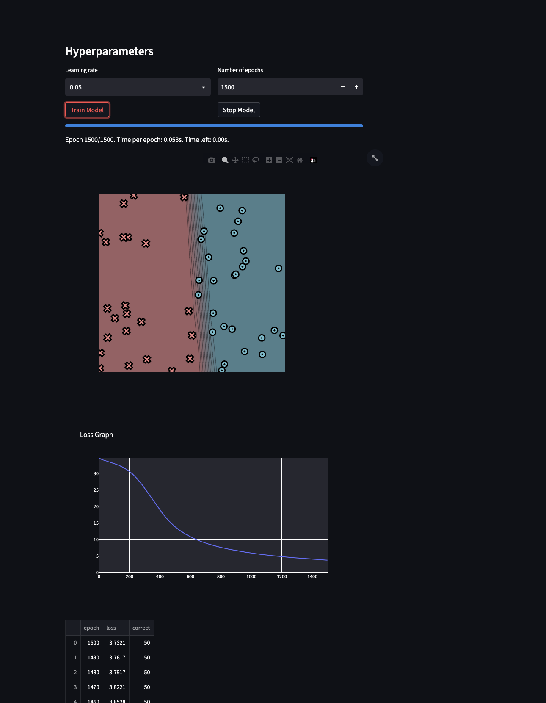
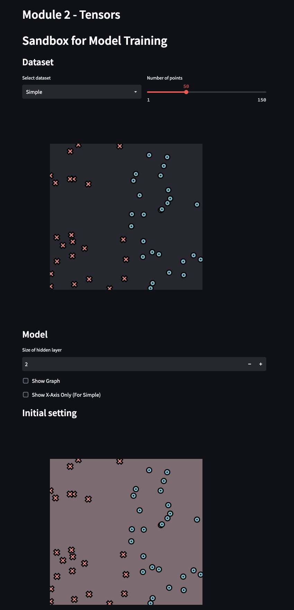
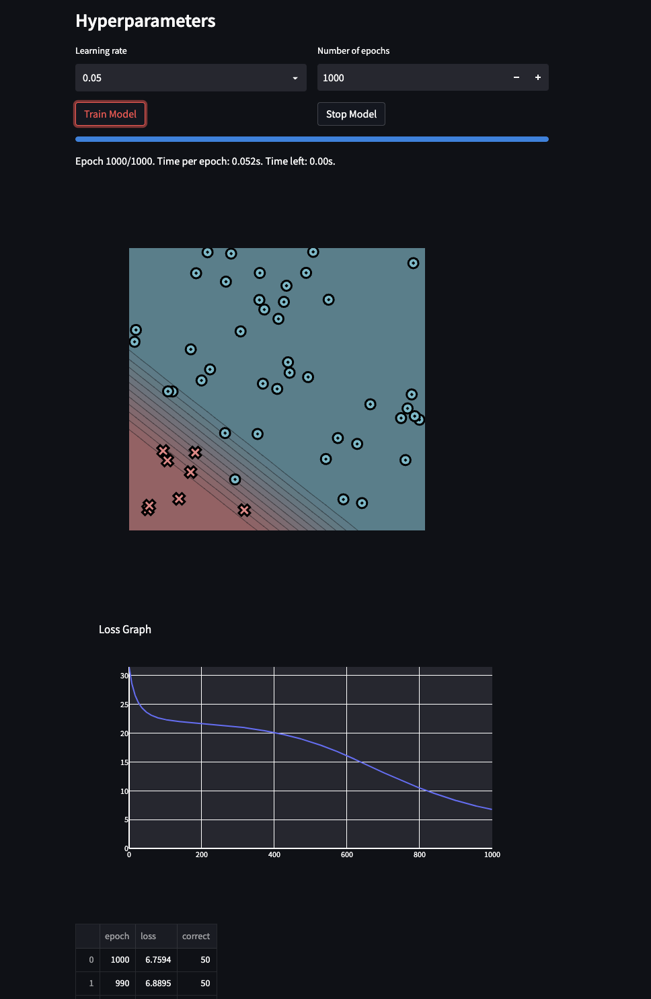
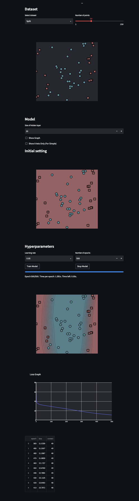
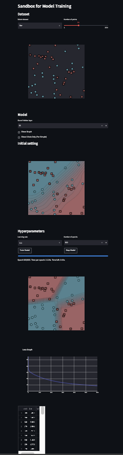

[](https://classroom.github.com/a/YFgwt0yY)

# MiniTorch Module 2


- Docs: <https://minitorch.github.io/>

- Overview: <https://minitorch.github.io/module2/module2/>

This assignment requires the following files from the previous assignments. You can get these by running

```bash
python sync_previous_module.py previous-module-dir current-module-dir
```

The files that will be synced are:

        minitorch/operators.py minitorch/module.py minitorch/autodiff.py minitorch/scalar.py minitorch/scalar_functions.py minitorch/module.py project/run_manual.py project/run_scalar.py project/datasets.py

## Number of points = 50 for all 4 datasets

## Simple

Learning rate: 0.05,
Number of epochs: 1500,
Time per Epoch: 0.053s,
Hidden Size: 2


Epoch: 10/1500, loss: 34.34065103677544, correct: 23
 Epoch: 20/1500, loss: 34.14424388020557, correct: 23
 Epoch: 30/1500, loss: 33.975777230291214, correct: 23
 Epoch: 40/1500, loss: 33.82210937160985, correct: 23
 Epoch: 50/1500, loss: 33.67643192794467, correct: 37
 Epoch: 60/1500, loss: 33.537653575655376, correct: 40
 Epoch: 70/1500, loss: 33.400246837725476, correct: 46
 Epoch: 80/1500, loss: 33.260645147775875, correct: 46
Epoch: 90/1500, loss: 33.11589989207305, correct: 46
Epoch: 100/1500, loss: 32.96350489528697, correct: 45
Epoch: 110/1500, loss: 32.8017335427709, correct: 44
Epoch: 120/1500, loss: 32.628306497737995, correct: 44
Epoch: 130/1500, loss: 32.440931290263435, correct: 44
Epoch: 140/1500, loss: 32.23745321162981, correct: 44
Epoch: 150/1500, loss: 32.01588367786879, correct: 44
Epoch: 160/1500, loss: 31.77477290252831, correct: 45
Epoch: 170/1500, loss: 31.51500807181833, correct: 47
Epoch: 180/1500, loss: 31.23172078052168, correct: 47
Epoch: 190/1500, loss: 30.922732772860805, correct: 47
Epoch: 200/1500, loss: 30.58590996064541, correct: 48
Epoch: 210/1500, loss: 30.218611527711605, correct: 48
Epoch: 220/1500, loss: 29.81791488497643, correct: 49
Epoch: 230/1500, loss: 29.380685170012928, correct: 49
Epoch: 240/1500, loss: 28.908936226121597, correct: 49
Epoch: 250/1500, loss: 28.41193608475052, correct: 49
Epoch: 260/1500, loss: 27.880421858591532, correct: 49
Epoch: 270/1500, loss: 27.323596843704788, correct: 49
Epoch: 280/1500, loss: 26.745712823550313, correct: 49
Epoch: 290/1500, loss: 26.14189713195496, correct: 49
Epoch: 300/1500, loss: 25.513307528733623, correct: 49
Epoch: 310/1500, loss: 24.862272613260565, correct: 49
Epoch: 320/1500, loss: 24.20755064800796, correct: 49
Epoch: 330/1500, loss: 23.540276319720302, correct: 49
Epoch: 340/1500, loss: 22.858887390152343, correct: 49
Epoch: 350/1500, loss: 22.18673449575296, correct: 49
Epoch: 360/1500, loss: 21.522744527554853, correct: 49
Epoch: 370/1500, loss: 20.858479627063982, correct: 49
Epoch: 380/1500, loss: 20.196435921173713, correct: 49
Epoch: 390/1500, loss: 19.545984617755956, correct: 49
Epoch: 400/1500, loss: 18.921613673989263, correct: 49
Epoch: 410/1500, loss: 18.315165244914425, correct: 49
Epoch: 420/1500, loss: 17.72481862804046, correct: 49
Epoch: 430/1500, loss: 17.152766272087778, correct: 49
Epoch: 440/1500, loss: 16.600826722147385, correct: 49
Epoch: 450/1500, loss: 16.073877715744057, correct: 49
Epoch: 460/1500, loss: 15.579257326273307, correct: 49
Epoch: 470/1500, loss: 15.112378637062013, correct: 49
Epoch: 480/1500, loss: 14.667646420670376, correct: 49
Epoch: 490/1500, loss: 14.245610801113164, correct: 49
Epoch: 500/1500, loss: 13.846088450431171, correct: 49
Epoch: 510/1500, loss: 13.469781890266148, correct: 49
Epoch: 520/1500, loss: 13.113642228193513, correct: 49
Epoch: 530/1500, loss: 12.775842934712816, correct: 49
Epoch: 540/1500, loss: 12.454201426467051, correct: 49
Epoch: 550/1500, loss: 12.14759721655346, correct: 49
Epoch: 560/1500, loss: 11.855213175043822, correct: 49
Epoch: 570/1500, loss: 11.578016897991382, correct: 49
Epoch: 580/1500, loss: 11.313677479069698, correct: 49
Epoch: 590/1500, loss: 11.06121258969732, correct: 49
Epoch: 600/1500, loss: 10.819902122159636, correct: 49
Epoch: 610/1500, loss: 10.589084607743303, correct: 49
Epoch: 620/1500, loss: 10.36814188855254, correct: 49
Epoch: 630/1500, loss: 10.156495976364507, correct: 49
Epoch: 640/1500, loss: 9.953606655607562, correct: 49
Epoch: 650/1500, loss: 9.758969134531599, correct: 49
Epoch: 660/1500, loss: 9.572617396014376, correct: 49
Epoch: 670/1500, loss: 9.394392208656308, correct: 49
Epoch: 680/1500, loss: 9.223084938073262, correct: 49
Epoch: 690/1500, loss: 9.058515997882091, correct: 49
Epoch: 700/1500, loss: 8.900946576772817, correct: 49
Epoch: 710/1500, loss: 8.749180066419608, correct: 49
Epoch: 720/1500, loss: 8.602846882760877, correct: 49
Epoch: 730/1500, loss: 8.461638440984222, correct: 49
Epoch: 740/1500, loss: 8.325269227736818, correct: 49
Epoch: 750/1500, loss: 8.193473878364166, correct: 49
Epoch: 760/1500, loss: 8.066005437164142, correct: 49
Epoch: 770/1500, loss: 7.9426338268219565, correct: 49
Epoch: 780/1500, loss: 7.823144478008712, correct: 49
Epoch: 790/1500, loss: 7.707337097498559, correct: 49
Epoch: 800/1500, loss: 7.595024556871764, correct: 49
Epoch: 810/1500, loss: 7.486031886649605, correct: 49
Epoch: 820/1500, loss: 7.380316629272677, correct: 49
Epoch: 830/1500, loss: 7.278322612262697, correct: 49
Epoch: 840/1500, loss: 7.179131653902971, correct: 49
Epoch: 850/1500, loss: 7.08259940555896, correct: 49
Epoch: 860/1500, loss: 6.988718659860772, correct: 49
Epoch: 870/1500, loss: 6.897406563056315, correct: 49
Epoch: 880/1500, loss: 6.808880034013769, correct: 49
Epoch: 890/1500, loss: 6.7226487834987445, correct: 49
Epoch: 900/1500, loss: 6.638434870451643, correct: 49
Epoch: 910/1500, loss: 6.55637924740863, correct: 49
Epoch: 920/1500, loss: 6.475973970377971, correct: 49
Epoch: 930/1500, loss: 6.397857156169351, correct: 49
Epoch: 940/1500, loss: 6.321208846295992, correct: 49
Epoch: 950/1500, loss: 6.246188453212474, correct: 49
Epoch: 960/1500, loss: 6.1732267951703, correct: 49
Epoch: 970/1500, loss: 6.10196788474119, correct: 49
Epoch: 980/1500, loss: 6.032545514290929, correct: 49
Epoch: 990/1500, loss: 5.96453651919643, correct: 49
Epoch: 1000/1500, loss: 5.898038335800189, correct: 49
Epoch: 1010/1500, loss: 5.832860895315222, correct: 49
Epoch: 1020/1500, loss: 5.769038132575315, correct: 49
Epoch: 1030/1500, loss: 5.706460564966168, correct: 49
Epoch: 1040/1500, loss: 5.645085768566169, correct: 49
Epoch: 1050/1500, loss: 5.584873939076641, correct: 49
Epoch: 1060/1500, loss: 5.5257873011471155, correct: 49
Epoch: 1070/1500, loss: 5.467901497709228, correct: 49
Epoch: 1080/1500, loss: 5.411417409353112, correct: 49
Epoch: 1090/1500, loss: 5.355929724008424, correct: 49
Epoch: 1100/1500, loss: 5.301535520503275, correct: 49
Epoch: 1110/1500, loss: 5.248361267044879, correct: 50
Epoch: 1120/1500, loss: 5.196044922304741, correct: 50
Epoch: 1130/1500, loss: 5.14490205614891, correct: 50
Epoch: 1140/1500, loss: 5.0946967312359455, correct: 50
Epoch: 1150/1500, loss: 5.045463103191213, correct: 50
Epoch: 1160/1500, loss: 4.997200505766649, correct: 50
Epoch: 1170/1500, loss: 4.949832606348186, correct: 50
Epoch: 1180/1500, loss: 4.903311541070899, correct: 50
Epoch: 1190/1500, loss: 4.857600240935965, correct: 50
Epoch: 1200/1500, loss: 4.812665095922047, correct: 50
Epoch: 1210/1500, loss: 4.768475503430796, correct: 50
Epoch: 1220/1500, loss: 4.7250035013635445, correct: 50
Epoch: 1230/1500, loss: 4.6822234491664245, correct: 50
Epoch: 1240/1500, loss: 4.640292738390312, correct: 50
Epoch: 1250/1500, loss: 4.599044733568359, correct: 50
Epoch: 1260/1500, loss: 4.558411719035001, correct: 50
Epoch: 1270/1500, loss: 4.518374643610989, correct: 50
Epoch: 1280/1500, loss: 4.478915904747159, correct: 50
Epoch: 1290/1500, loss: 4.440019154563753, correct: 50
Epoch: 1300/1500, loss: 4.401669150957883, correct: 50
Epoch: 1310/1500, loss: 4.363851629037471, correct: 50
Epoch: 1320/1500, loss: 4.326553190297735, correct: 50
Epoch: 1330/1500, loss: 4.289761207076372, correct: 50
Epoch: 1340/1500, loss: 4.253463740137078, correct: 50
Epoch: 1350/1500, loss: 4.217649467518326, correct: 50
Epoch: 1360/1500, loss: 4.182307623036995, correct: 50
Epoch: 1370/1500, loss: 4.147427943057611, correct: 50
Epoch: 1380/1500, loss: 4.113000620331001, correct: 50
Epoch: 1390/1500, loss: 4.079016263874344, correct: 50
Epoch: 1400/1500, loss: 4.0454658640111525, correct: 50
Epoch: 1410/1500, loss: 4.012340761816567, correct: 50
Epoch: 1420/1500, loss: 3.97963262232331, correct: 50
Epoch: 1430/1500, loss: 3.947333410938686, correct: 50
Epoch: 1440/1500, loss: 3.9154353726047018, correct: 50
Epoch: 1450/1500, loss: 3.8839310133037097, correct: 50
Epoch: 1460/1500, loss: 3.8528130835722876, correct: 50
Epoch: 1470/1500, loss: 3.8220745637374343, correct: 50
Epoch: 1480/1500, loss: 3.7917086506332547, correct: 50
Epoch: 1490/1500, loss: 3.7617087455935807, correct: 50
Epoch: 1500/1500, loss: 3.7320684435476834, correct: 50

## Diag

Learning Rate: 0.05,
Hidden Size: 2,
Number of epochs: 1000,
Time per Epoch: 0.052s


Epoch: 10/1000, loss: 28.236477643148177, correct: 42
Epoch: 20/1000, loss: 26.187883636021866, correct: 42
Epoch: 30/1000, loss: 24.94787145684759, correct: 42
Epoch: 40/1000, loss: 24.140927247692144, correct: 42
Epoch: 50/1000, loss: 23.586718173076402, correct: 42
Epoch: 60/1000, loss: 23.190610142160168, correct: 42
Epoch: 70/1000, loss: 22.898303219893126, correct: 42
Epoch: 80/1000, loss: 22.67679955233599, correct: 42
Epoch: 90/1000, loss: 22.504763774903687, correct: 42
Epoch: 100/1000, loss: 22.368092846541135, correct: 42
Epoch: 110/1000, loss: 22.257088543511646, correct: 42
Epoch: 120/1000, loss: 22.164938831222354, correct: 42
Epoch: 130/1000, loss: 22.086665154645704, correct: 42
Epoch: 140/1000, loss: 22.01861111696459, correct: 42
Epoch: 150/1000, loss: 21.95801552940137, correct: 42
Epoch: 160/1000, loss: 21.902749848227355, correct: 42
Epoch: 170/1000, loss: 21.851137587372545, correct: 42
Epoch: 180/1000, loss: 21.802315801028282, correct: 42
Epoch: 190/1000, loss: 21.75484683226614, correct: 42
Epoch: 200/1000, loss: 21.70774942729371, correct: 42
Epoch: 210/1000, loss: 21.6603839744829, correct: 42
Epoch: 220/1000, loss: 21.612288990973834, correct: 42
Epoch: 230/1000, loss: 21.562513044525097, correct: 42
Epoch: 240/1000, loss: 21.5104520459815, correct: 42
Epoch: 250/1000, loss: 21.455516022922684, correct: 42
Epoch: 260/1000, loss: 21.39711417915011, correct: 42
Epoch: 270/1000, loss: 21.33471465312377, correct: 42
Epoch: 280/1000, loss: 21.2704031915758, correct: 42
Epoch: 290/1000, loss: 21.20128904328855, correct: 42
Epoch: 300/1000, loss: 21.126748432234436, correct: 42
Epoch: 310/1000, loss: 21.046123000017673, correct: 42
Epoch: 320/1000, loss: 20.95887629483121, correct: 42
Epoch: 330/1000, loss: 20.867730641730294, correct: 42
Epoch: 340/1000, loss: 20.770429598612342, correct: 42
Epoch: 350/1000, loss: 20.67288545786362, correct: 42
Epoch: 360/1000, loss: 20.57022472315203, correct: 42
Epoch: 370/1000, loss: 20.466927188783433, correct: 42
Epoch: 380/1000, loss: 20.358272094643883, correct: 42
Epoch: 390/1000, loss: 20.244563160933843, correct: 42
Epoch: 400/1000, loss: 20.123487836592005, correct: 42
Epoch: 410/1000, loss: 19.996259825216487, correct: 42
Epoch: 420/1000, loss: 19.862449857650954, correct: 42
Epoch: 430/1000, loss: 19.72090591002498, correct: 42
Epoch: 440/1000, loss: 19.57177715750081, correct: 42
Epoch: 450/1000, loss: 19.417666641308347, correct: 42
Epoch: 460/1000, loss: 19.255469705385593, correct: 42
Epoch: 470/1000, loss: 19.083895662073402, correct: 42
Epoch: 480/1000, loss: 18.90234483799594, correct: 42
Epoch: 490/1000, loss: 18.712441136406138, correct: 42
Epoch: 500/1000, loss: 18.516652708307145, correct: 42
Epoch: 510/1000, loss: 18.313078088770553, correct: 42
Epoch: 520/1000, loss: 18.10131391493361, correct: 42
Epoch: 530/1000, loss: 17.881102647220832, correct: 42
Epoch: 540/1000, loss: 17.65341823960163, correct: 42
Epoch: 550/1000, loss: 17.41721840887565, correct: 42
Epoch: 560/1000, loss: 17.172069889802163, correct: 42
Epoch: 570/1000, loss: 16.918078179727445, correct: 42
Epoch: 580/1000, loss: 16.6583510219352, correct: 42
Epoch: 590/1000, loss: 16.390544485943835, correct: 42
Epoch: 600/1000, loss: 16.1146679510104, correct: 42
Epoch: 610/1000, loss: 15.832400514853088, correct: 42
Epoch: 620/1000, loss: 15.545557071035969, correct: 42
Epoch: 630/1000, loss: 15.254159909049058, correct: 42
Epoch: 640/1000, loss: 14.961526101172142, correct: 42
Epoch: 650/1000, loss: 14.669016501949091, correct: 42
Epoch: 660/1000, loss: 14.37391724692584, correct: 44
Epoch: 670/1000, loss: 14.079502982894164, correct: 44
Epoch: 680/1000, loss: 13.785483716247295, correct: 44
Epoch: 690/1000, loss: 13.492474462116945, correct: 44
Epoch: 700/1000, loss: 13.207238853722608, correct: 45
Epoch: 710/1000, loss: 12.924153130545347, correct: 45
Epoch: 720/1000, loss: 12.642589763316916, correct: 45
Epoch: 730/1000, loss: 12.361907883540468, correct: 45
Epoch: 740/1000, loss: 12.082589221961348, correct: 45
Epoch: 750/1000, loss: 11.807173468505404, correct: 45
Epoch: 760/1000, loss: 11.53746367147881, correct: 46
Epoch: 770/1000, loss: 11.270541742474462, correct: 46
Epoch: 780/1000, loss: 11.011276423738204, correct: 47
Epoch: 790/1000, loss: 10.758011193902025, correct: 48
Epoch: 800/1000, loss: 10.50854838204371, correct: 48
Epoch: 810/1000, loss: 10.266186494008338, correct: 48
Epoch: 820/1000, loss: 10.031960323894937, correct: 48
Epoch: 830/1000, loss: 9.802389236655882, correct: 49
Epoch: 840/1000, loss: 9.577367053685842, correct: 49
Epoch: 850/1000, loss: 9.357142981282289, correct: 49
Epoch: 860/1000, loss: 9.141719711958098, correct: 49
Epoch: 870/1000, loss: 8.931420874810751, correct: 49
Epoch: 880/1000, loss: 8.726278515012583, correct: 49
Epoch: 890/1000, loss: 8.526508872201784, correct: 49
Epoch: 900/1000, loss: 8.332166211446816, correct: 49
Epoch: 910/1000, loss: 8.143337018711346, correct: 49
Epoch: 920/1000, loss: 7.960032265637986, correct: 49
Epoch: 930/1000, loss: 7.784020410903171, correct: 49
Epoch: 940/1000, loss: 7.619653701559413, correct: 49
Epoch: 950/1000, loss: 7.462397660874992, correct: 49
Epoch: 960/1000, loss: 7.310072042524955, correct: 49
Epoch: 970/1000, loss: 7.162574109209723, correct: 49
Epoch: 980/1000, loss: 7.023601213893057, correct: 50
Epoch: 990/1000, loss: 6.889456925212637, correct: 50
Epoch: 1000/1000, loss: 6.7593547334144475, correct: 50

## Split

Learning Rate: 0.05,
Hidden Size: 20,
Number of Epochs: 500,
Time per epoch: 1.391s


Epoch: 10/500, loss: 35.68427482433839, correct: 28
Epoch: 20/500, loss: 33.82064927606033, correct: 29
Epoch: 30/500, loss: 32.88238067148416, correct: 29
Epoch: 40/500, loss: 32.10574413965922, correct: 31
Epoch: 50/500, loss: 31.571423141511428, correct: 32
Epoch: 60/500, loss: 31.061532132734342, correct: 34
Epoch: 70/500, loss: 30.549478621823194, correct: 35
Epoch: 80/500, loss: 30.171573343313973, correct: 34
Epoch: 90/500, loss: 29.64041679028214, correct: 35
Epoch: 100/500, loss: 29.0992122952564, correct: 36
Epoch: 110/500, loss: 28.637331036091886, correct: 36
Epoch: 120/500, loss: 28.1769860381096, correct: 36
Epoch: 130/500, loss: 27.71785866385192, correct: 36
Epoch: 140/500, loss: 27.245587471589662, correct: 38
Epoch: 150/500, loss: 26.70835534151808, correct: 40
Epoch: 160/500, loss: 26.161773789837735, correct: 41
Epoch: 170/500, loss: 25.62732792209092, correct: 42
Epoch: 180/500, loss: 25.12249362638895, correct: 44
Epoch: 190/500, loss: 24.62170500745441, correct: 46
Epoch: 200/500, loss: 24.122114391122597, correct: 46
Epoch: 210/500, loss: 23.598419583591607, correct: 46
Epoch: 220/500, loss: 23.063464985482867, correct: 46
Epoch: 230/500, loss: 22.53112006835824, correct: 47
Epoch: 240/500, loss: 21.986035784570092, correct: 47
Epoch: 250/500, loss: 21.438290902268168, correct: 47
Epoch: 260/500, loss: 20.89811681005223, correct: 47
Epoch: 270/500, loss: 20.347012921064536, correct: 47
Epoch: 280/500, loss: 19.79302341973265, correct: 47
Epoch: 290/500, loss: 19.248050593446006, correct: 47
Epoch: 300/500, loss: 18.668368046491082, correct: 47
Epoch: 310/500, loss: 18.13426436747274, correct: 47
Epoch: 320/500, loss: 17.638116998320815, correct: 47
Epoch: 330/500, loss: 17.15978656667199, correct: 47
Epoch: 340/500, loss: 16.693646320675963, correct: 47
Epoch: 350/500, loss: 16.23162768839281, correct: 47
Epoch: 360/500, loss: 15.785455435927224, correct: 47
Epoch: 370/500, loss: 15.354363471130752, correct: 47
Epoch: 380/500, loss: 14.93879045112093, correct: 47
Epoch: 390/500, loss: 14.539416392092082, correct: 47
Epoch: 400/500, loss: 14.160628743705, correct: 48
Epoch: 410/500, loss: 13.797153475487228, correct: 48
Epoch: 420/500, loss: 13.448320636113408, correct: 48
Epoch: 430/500, loss: 13.11254128238377, correct: 48
Epoch: 440/500, loss: 12.78944576401926, correct: 49
Epoch: 450/500, loss: 12.476019112501671, correct: 49
Epoch: 460/500, loss: 12.173670003395225, correct: 48
Epoch: 470/500, loss: 11.882959863477636, correct: 49
Epoch: 480/500, loss: 11.59871422681326, correct: 48
Epoch: 490/500, loss: 11.31066842223339, correct: 49
Epoch: 500/500, loss: 11.033930178922517, correct: 49

## XOR

Learning Rate: 0.1,
Hidden Size: 25,
Number of Epochs: 600,
Time per epoch: 2.124s


Epoch: 10/500, loss: 33.02083403016218, correct: 27
Epoch: 20/500, loss: 29.13232760252905, correct: 38
Epoch: 30/500, loss: 26.95985677244597, correct: 39
Epoch: 40/500, loss: 26.005632186478437, correct: 39
Epoch: 50/500, loss: 23.464639193213344, correct: 42
Epoch: 60/500, loss: 22.611723361133812, correct: 42
Epoch: 70/500, loss: 22.324301187957456, correct: 39
Epoch: 80/500, loss: 20.788255448102138, correct: 43
Epoch: 90/500, loss: 20.017939300666928, correct: 43
Epoch: 100/500, loss: 19.04681947942745, correct: 44
Epoch: 110/500, loss: 18.116369644581624, correct: 45
Epoch: 120/500, loss: 17.361284601187776, correct: 45
Epoch: 130/500, loss: 16.597876179491315, correct: 45
Epoch: 140/500, loss: 15.822568788528466, correct: 45
Epoch: 150/500, loss: 15.167103685686074, correct: 45
Epoch: 160/500, loss: 14.804199322617553, correct: 45
Epoch: 170/500, loss: 14.60500037474138, correct: 45
Epoch: 180/500, loss: 14.109755756354845, correct: 45
Epoch: 190/500, loss: 13.714435053515865, correct: 45
Epoch: 200/500, loss: 13.495482041449044, correct: 45
Epoch: 210/500, loss: 12.965194237955894, correct: 45
Epoch: 220/500, loss: 12.52820698662463, correct: 45
Epoch: 230/500, loss: 12.219974038856416, correct: 45
Epoch: 240/500, loss: 12.003799410312812, correct: 45
Epoch: 250/500, loss: 11.768652154768821, correct: 45
Epoch: 260/500, loss: 11.538005177658437, correct: 45
Epoch: 270/500, loss: 11.349447246328822, correct: 45
Epoch: 280/500, loss: 11.135006629771743, correct: 45
Epoch: 290/500, loss: 10.986925125738045, correct: 45
Epoch: 300/500, loss: 10.811262366199022, correct: 45
Epoch: 310/500, loss: 10.5951465035863, correct: 45
Epoch: 320/500, loss: 10.468713135814104, correct: 45
Epoch: 330/500, loss: 10.308341649642855, correct: 45
Epoch: 340/500, loss: 10.240588253719313, correct: 45
Epoch: 350/500, loss: 10.046960941810745, correct: 45
Epoch: 360/500, loss: 9.86005286054027, correct: 45
Epoch: 370/500, loss: 9.683107309618796, correct: 45
Epoch: 380/500, loss: 9.564709498450107, correct: 45
Epoch: 390/500, loss: 9.449082641303525, correct: 45
Epoch: 400/500, loss: 9.392902184286925, correct: 45
Epoch: 410/500, loss: 9.186864624253943, correct: 45
Epoch: 420/500, loss: 9.107653527388715, correct: 45
Epoch: 430/500, loss: 8.941102305998443, correct: 45
Epoch: 440/500, loss: 8.849330043229704, correct: 45
Epoch: 450/500, loss: 8.780825625725083, correct: 45
Epoch: 460/500, loss: 8.627549845744419, correct: 45
Epoch: 470/500, loss: 8.54047804564184, correct: 45
Epoch: 480/500, loss: 8.444543019378187, correct: 46
Epoch: 490/500, loss: 8.37964648548154, correct: 45
Epoch: 500/500, loss: 8.254558238952706, correct: 46
Epoch: 0/600, loss: 0, correct: 0
Epoch: 10/600, loss: 32.173755303612666, correct: 26
Epoch: 20/600, loss: 30.16534619377351, correct: 28
Epoch: 30/600, loss: 28.80824344368794, correct: 31
Epoch: 40/600, loss: 27.716213168880795, correct: 32
Epoch: 50/600, loss: 26.66545154656093, correct: 33
Epoch: 60/600, loss: 25.811222984376084, correct: 34
Epoch: 70/600, loss: 25.040808000943777, correct: 35
Epoch: 80/600, loss: 24.302859271483676, correct: 37
Epoch: 90/600, loss: 23.539284524296125, correct: 38
Epoch: 100/600, loss: 22.682302541197423, correct: 40
Epoch: 110/600, loss: 21.85654160128618, correct: 41
Epoch: 120/600, loss: 21.163937858217313, correct: 43
Epoch: 130/600, loss: 20.557074121188194, correct: 44
Epoch: 140/600, loss: 19.97435816595267, correct: 44
Epoch: 150/600, loss: 19.444338451657995, correct: 44
Epoch: 160/600, loss: 18.92703594908569, correct: 44
Epoch: 170/600, loss: 18.429887306190626, correct: 44
Epoch: 180/600, loss: 17.94740481926918, correct: 44
Epoch: 190/600, loss: 17.48549651237031, correct: 44
Epoch: 200/600, loss: 17.037748480516818, correct: 45
Epoch: 210/600, loss: 16.609698992284095, correct: 46
Epoch: 220/600, loss: 16.19653680674455, correct: 46
Epoch: 230/600, loss: 15.801374942508588, correct: 47
Epoch: 240/600, loss: 15.434074238588046, correct: 47
Epoch: 250/600, loss: 15.076196659739328, correct: 47
Epoch: 260/600, loss: 14.735338120413875, correct: 47
Epoch: 270/600, loss: 14.404470814398701, correct: 47
Epoch: 280/600, loss: 14.095777650630632, correct: 47
Epoch: 290/600, loss: 13.80434561464018, correct: 47
Epoch: 300/600, loss: 13.531575762332983, correct: 47
Epoch: 310/600, loss: 13.266635558245794, correct: 47
Epoch: 320/600, loss: 13.014593952305628, correct: 47
Epoch: 330/600, loss: 12.774721925622238, correct: 47
Epoch: 340/600, loss: 12.543911931104688, correct: 47
Epoch: 350/600, loss: 12.321644595212971, correct: 47
Epoch: 360/600, loss: 12.108031530664256, correct: 47
Epoch: 370/600, loss: 11.905272196123471, correct: 47
Epoch: 380/600, loss: 11.705525739670241, correct: 47
Epoch: 390/600, loss: 11.51261889192118, correct: 47
Epoch: 400/600, loss: 11.332132269888248, correct: 47
Epoch: 410/600, loss: 11.155996921752498, correct: 47
Epoch: 420/600, loss: 10.970179291905065, correct: 47
Epoch: 430/600, loss: 10.774072746626025, correct: 47
Epoch: 440/600, loss: 10.605724342130108, correct: 47
Epoch: 450/600, loss: 10.446156513793586, correct: 47
Epoch: 460/600, loss: 10.2904092401921, correct: 47
Epoch: 470/600, loss: 10.125004288429718, correct: 47
Epoch: 480/600, loss: 9.95723499043407, correct: 47
Epoch: 490/600, loss: 9.798460627861168, correct: 47
Epoch: 500/600, loss: 9.660382803882012, correct: 48
Epoch: 510/600, loss: 9.529020060445644, correct: 48
Epoch: 520/600, loss: 9.40154496460183, correct: 48
Epoch: 530/600, loss: 9.276315095728807, correct: 48
Epoch: 540/600, loss: 9.157595348300337, correct: 48
Epoch: 550/600, loss: 9.035689538598163, correct: 48
Epoch: 560/600, loss: 8.92022980074446, correct: 49
Epoch: 570/600, loss: 8.807573477094842, correct: 49
Epoch: 580/600, loss: 8.695956542438891, correct: 50
Epoch: 590/600, loss: 8.588256643160422, correct: 50
Epoch: 600/600, loss: 8.483867439846128, correct: 49
